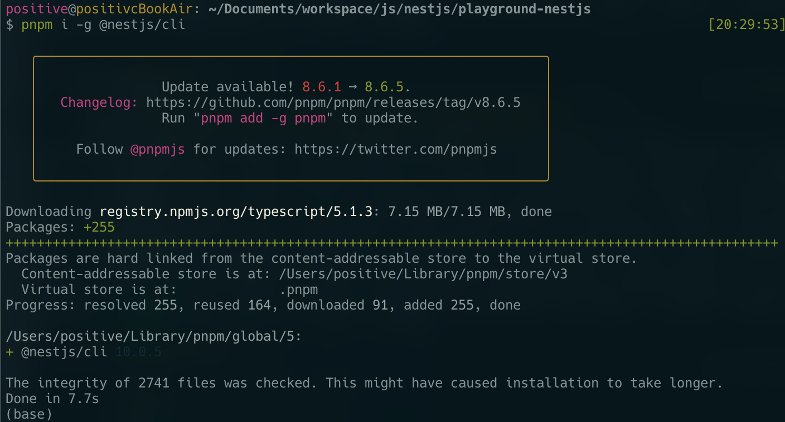
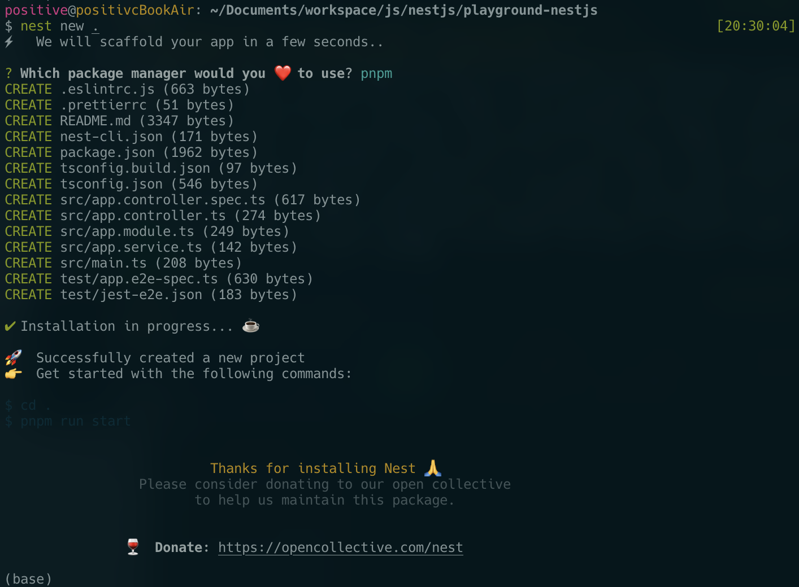

# Playground By Nestjs

> nodejs のフレームワークの中で生産性が高い物がある。。らしく。試してみます。

> 最近 node package manager (NPM)の方はコンソールがあまり綺麗じゃないので
> yarn を使ってたんですが、yarn よりも綺麗な物を見つかってしまいました。
> 「pnpm」でございます。

```shell
# pnpmインストール
npm install -g pnpm
# pnpmのセットアップ
pnpm setup
# セットアップの内容をshellに反映
source ~/.zshrc
```

## Description

### NestJs とは

### NestJs/cli インストール

```shell
pnpm i -g @nestjs/cli
```

> 

### nestjs のプロジェクト生成

```shell
# プロジェクトのフォルダを生成
mkdir playground-nestjs

# 生成したフォルダの中へ移動
cd playground-nestjs

# nestjsのプロジェクト生成
nest new .
```

> 

### NestJs の基本構成

> - eslintrc.js
> - prettierrc
> - nest-cli.json
>   1.  nest プロジェクトを為細かい設定を定義する json ファイル
> - tsconfig.json
>   1.  typescript のコンパイルの設定を定義
> - tsconfig.build.json
>   1.  tsconfig.json の１種類であり、build 時必要な設定を定義
>   2.  "excludes"にはビルド時除外するファイルを指定することができる。
> - package.json

### NestJs のロジックの流れ

module -> xxx-module -> xxx-controller -> xxx-service

### NestJs モジュール

フロンドから request がある時一番早めに辿り着く場所

### Board の Module 生成

nest はコマンドでファイルを自動生成する機能がついている

```shell
nest g module boards
```

### NestJs の Controller とは？

> ブラウザから request がきたら
> http メソッドにより request を分配し処理を返す処理を行う

- @(デコレーター)
- handler(ハンドラー) - メソッド

### Board の Controller 生成

```shell
# nest: nestcliを使います
# g : generate(生成)
# controller : controllerを生成
# boards : controllerの名称
# --no-spec : テストコードを生成しない
nest g controller boards --no-spec
```

### Nestjs Providers, Service とは

DB のデータ取得やビジネスロジックを担当

```shell
nest g service boards --no-spec
```

@Injectable：他のコンポーネントからこのサービスを使えるようにしてくれるデコレーター
(DI の概念)

providers は module にこのサービスを使いますという事を宣言する時サービスの配列を設定する必要がある。

contoller から service を呼び出すためには、constructor の変数でサービスオブジェクトをもらえるが、その方法は以下のようになる。

```javascript
boardsService: BoardsService;

constructor(boardsServices: BoardsService) {
  this.boardsService = boardsService;
}
```

↓ に省略もできる

```typescript
constructor(private boardsServices: BoardsService) { }
```

---

---

## Installation

```bash
$ pnpm install
```

## Running the app

```bash
# development
$ pnpm run start

# watch mode
$ pnpm run start:dev

# production mode
$ pnpm run start:prod
```

## Test

```bash
# unit tests
$ pnpm run test

# e2e tests
$ pnpm run test:e2e

# test coverage
$ pnpm run test:cov
```

## License

[MIT licensed](LICENSE).
